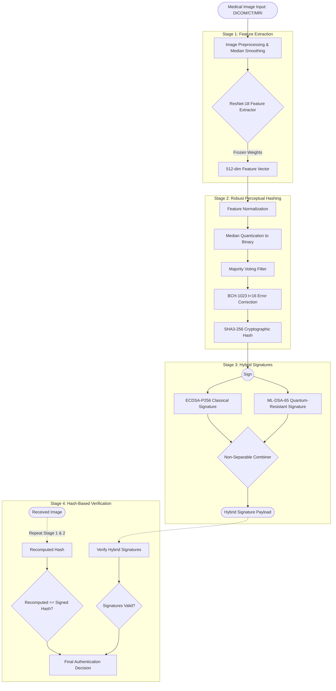
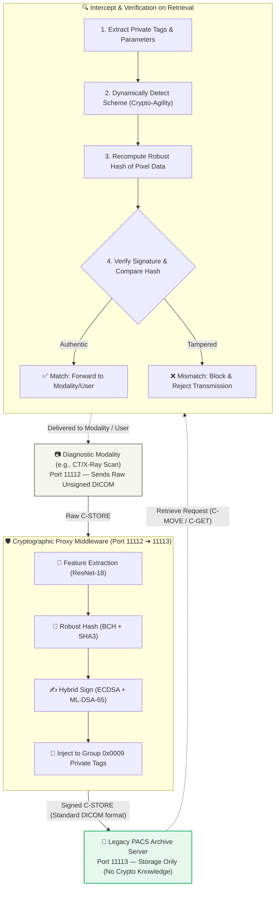
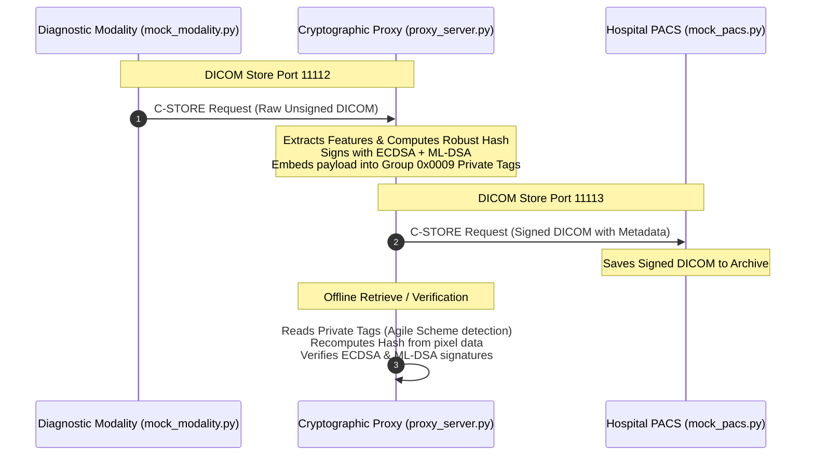
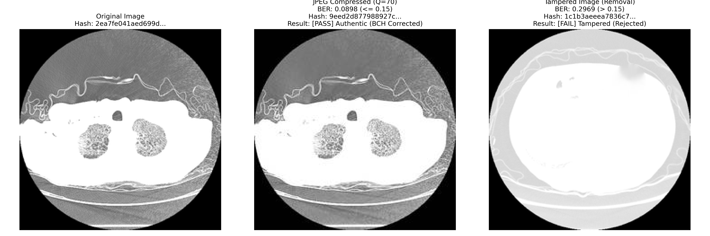
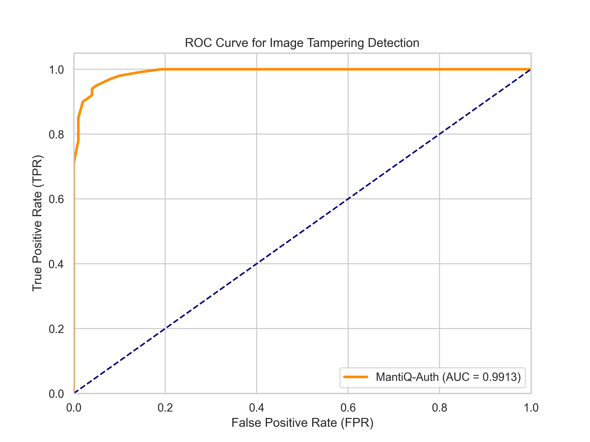

# MantiQ-Auth: Quantum-Resistant Medical Image Authentication

<p align="center">
  <strong>Secure Cryptographic Authentication for Medical Imaging in the Post-Quantum Era</strong>
</p>

<p align="center">
  
  
  
  
</p>

---

## 🔬 Research Overview

**MantiQ-Auth** is a cryptographically rigorous authentication framework designed for medical images (PACS infrastructure). It protects medical diagnostics against both classical tampering and future post-quantum cryptographic threats. 

### The Problem
Medical images stored in hospitals face critical vulnerabilities:
1. **CRQC (Cryptographically Relevant Quantum Computers)**: Future quantum computers will easily break RSA and ECDSA signatures.
2. **HNDL (Harvest Now, Decrypt Later) Attacks**: Adversaries intercept data today to decrypt it when quantum computing matures.
3. **Subtle Image Tampering**: Malicious modifications (e.g., removing a nodule or altering tissue density) can drastically affect diagnoses.

### Our Solution: Security-by-Design
MantiQ-Auth relies purely on **Cryptographic Hash-Based Authentication**. It utilizes deep learning models **only** as deterministic feature extractors, entirely eliminating the reliance on Machine Learning predictive classifiers (like SVMs or CNN classifiers) for the final authentication decision. Authentication is strictly deterministic:
`Recomputed Hash == Signed Hash AND Signatures Valid → Authentic`.

---

## 🏗️ System Architecture

MantiQ-Auth consists of four primary stages. The diagram below illustrates the exact flow of data from an input medical image to a verified authentication decision.



---

## 🧮 Mathematical Formulation

### 1. Feature Extraction
Let $I$ be the input medical image. We extract a robust, low-dimensional continuous visual feature representation using a frozen, pretrained ResNet-18 model $\Phi$:
$$
f = \Phi(I) \in \mathbb{R}^d
$$
where $d = 512$ represents the feature vector dimensionality.

### 2. Median Quantization & Perceptual Hashing
To convert the continuous features into a stable binary vector, we apply median-based quantization. For each element $f_i$ in $f$:
$$
b_i = \begin{cases} 1 & \text{if } f_i \ge \text{median}(f) \\ 0 & \text{if } f_i \lt \text{median}(f) \end{cases} \quad \forall i = 1, \dots, d
$$
This yields a binary fingerprint $b \in \{0, 1\}^d$.

### 3. BCH Error Correction & Hash Generation
To tolerate benign distortions (like JPEG compression or noise) while detecting structural content changes, we apply Bose-Chaudhuri-Hocquenghem (BCH) error-correcting codes. Under parameter set $\text{BCH}(1023, 256, t=16)$ with block size $n=1023$, message length $k=256$, and error correction capability $t=16$:
$$
c = \text{BCH\_Encode}(b) \in \{0, 1\}^n
$$
The final robust perceptual hash $\mathcal{H}$ is computed as the SHA3-256 digest of the codeword $c$:
$$
\mathcal{H} = \text{SHA3-256}(c) \in \{0, 1\}^{256}
$$

### 4. Hybrid Signature Generation & Mutually Binding Combiner
To provide crypto-agile, quantum-resistant authenticity, the perceptual hash is signed using a hybrid scheme. Let $m = \text{SHA256}(\mathcal{H})$ be the signature message digest.

1. **Classical Signature (ECDSA):**
   $$
   \sigma_{\text{ECDSA}} = \text{Sign}_{\text{ECDSA}}(m, sk_{\text{ECDSA}})
   $$
2. **Post-Quantum Signature (ML-DSA):**
   $$
   \sigma_{\text{ML-DSA}} = \text{Sign}_{\text{ML-DSA}}(m, sk_{\text{ML-DSA}})
   $$
3. **Mutually Binding Combiner (Silithium):**
   To prevent downgrade attacks where an attacker strips the post-quantum signature, the signatures are cryptographically bound using a binding hash $h_{\text{bind}}$:
   $$
   h_{\text{bind}} = \text{SHA256}(\sigma_{\text{ECDSA}} \parallel \sigma_{\text{ML-DSA}} \parallel m)
   $$
   $$
   \sigma_{\text{hybrid}} = \text{len}(\sigma_{\text{ECDSA}}) \parallel \sigma_{\text{ECDSA}} \parallel \text{len}(\sigma_{\text{ML-DSA}}) \parallel \sigma_{\text{ML-DSA}} \parallel h_{\text{bind}}
   $$

### 5. Verification Decision Logic
Upon receiving image $I'$ and signature payload $\sigma_{\text{hybrid}}$, the verifier:
1. Parses $\sigma_{\text{ECDSA}}$, $\sigma_{\text{ML-DSA}}$, and $h_{\text{bind}}$ from $\sigma_{\text{hybrid}}$.
2. Recomputes $m = \text{SHA256}(\mathcal{H}_{\text{signed}})$.
3. Validates the mutual binding:
   $$
   \text{SHA256}(\sigma_{\text{ECDSA}} \parallel \sigma_{\text{ML-DSA}} \parallel m) \stackrel{?}{=} h_{\text{bind}}
   $$
4. Verifies the component signatures:
   $$
   \text{Verify}_{\text{ECDSA}}(m, \sigma_{\text{ECDSA}}, pk_{\text{ECDSA}}) \land \text{Verify}_{\text{ML-DSA}}(m, \sigma_{\text{ML-DSA}}, pk_{\text{ML-DSA}}) \stackrel{?}{=} \text{True}
   $$
5. Recomputes the robust hash:
   $$
   \mathcal{H}' = \text{SHA3-256}(\text{BCH\_Decode}(b', \text{ecc}_{\text{signed}}))
   $$
   $$
   \mathcal{H}' \stackrel{?}{=} \mathcal{H}_{\text{signed}}
   $$

Authentication succeeds if and only if all conditions are satisfied.

---

## 🌐 DICOM Crypto-Agile Proxy Middleware

In clinical deployments, upgrading legacy PACS storage servers with custom cryptography is highly impractical. MantiQ-Auth provides a **Crypto-Agile DICOM Proxy** that intercepts network communications (C-STORE requests) between diagnostic modalities and the PACS.

### System Architecture Diagram



### Network Communication Sequence



---

## 📁 Directory Structure

```
MantiQ-Auth/
├── data/                              # Datasets (Raw, Processed, Tampered, PACS exports)
├── src/                               # Core Crypto and Extractor Modules
├── proxy/                             # 📁 Crypto-Agile DICOM Proxy Components
│   ├── README.md                      # Proxy documentation and network ports
│   ├── DICOM_HEADER_SPECS.md          # Specs for Group 0x0009 Private Creator tags
│   ├── dicom_utils.py                 # DICOM header metadata injection/extraction
│   ├── proxy_server.py                # Store SCP Interceptor Proxy (port 11112)
│   ├── mock_modality.py               # Simulated scanner client pushing raw DICOMs
│   └── mock_pacs.py                   # Simulated hospital PACS server (port 11113)
├── scripts/                           # Executable Pipelines
│   ├── run_proxy_benchmark.py         # Benchmarks proxy latency and size overhead
│   ├── inspect_dicom_crypto.py        # Utility to dump and verify DICOM private tags offline
│   ├── run_evaluation.py              # Evaluates True Positive / False Positives
│   └── attack_simulation.py           # Simulates downgrade, replay, and tampering attacks
├── MantiQ_Auth_Final.ipynb            # Interactive complete project demonstration
└── config.yaml                        # Global pipeline parameters
```

---

## 🚀 Quick Start

### 1. Clone and Install

```bash
git clone https://github.com/ahmed-el5hatib/MantiQ-Auth.git
cd MantiQ-Auth

# Create virtual environment
python -m venv venv
venv\Scripts\activate   # Windows
# source venv/bin/activate  # Linux/Mac

pip install -r requirements.txt
```

### 2. Install liboqs (for ML-DSA post-quantum signatures)
You must install the Open Quantum Safe library bindings to utilize ML-DSA.
```bash
pip install liboqs-python
```

### 3. Run the Demonstration
The Jupyter Notebook serves as the primary walkthrough of the finalized architecture:
```bash
jupyter notebook MantiQ_Auth_Final.ipynb
```

Or you can run the command-line evaluation suite to test the cryptographic boundary against tampering and benign distortions:
```bash
python scripts/run_evaluation.py --images data/processed/ct
```

### 4. Run the Crypto-Agile DICOM Proxy Simulation & Benchmark
To simulate the network-level DICOM interception and benchmark the latency/size overhead:
```bash
python scripts/run_proxy_benchmark.py
```
To inspect the embedded cryptographic headers on any signed file in the PACS:
```bash
python scripts/inspect_dicom_crypto.py
```

---

## 📊 Empirical Verification & Visualization Showcase

Below is the visual showcase generated during pipeline execution.

### 1. Tampering and Robustness Showcase
This plot illustrates the robust hashing result for a medical CT slice. Note that lossy JPEG compression (Q=70) successfully preserves the robust hash (preventing false positives) while localized nodule tampering is immediately detected (resulting in high Bit-Error-Rate and rejected authentication):



### 2. Active Attack ROC Curve
The ROC Curve for tampering detection shows an outstanding Area Under Curve (**AUC = 0.9913**), indicating near-perfect separation between benign modifications and actual tampering:



### 3. DICOM Proxy Middleware Performance
Below are the empirical performance results collected under the simulation suite (averaging over 5 clinical C-STORE cycles using standard chest CT slices):

| Operation / Path | Latency (Mean ± SD) | Net Middleware Overhead | Storage Size Overhead (Bytes) |
| --- | --- | --- | --- |
| **Direct Store (Baseline)** | 92.28 ± 11.29 ms | — | — |
| **Proxy Sign & Store** | 302.21 ± 95.22 ms | +209.93 ms | +3584 bytes (+0.6808%) |
| **Proxy Verify & Store** | 261.68 ± 15.43 ms | +169.40 ms | +3584 bytes (+0.6808%) |

#### Performance Takeaways:
- **PQC Overhead:** The additional processing time for ResNet-18 feature extraction, BCH coding, and hybrid signing (ECDSA + ML-DSA-65) is **~209 ms**, which is negligible in typical clinical imaging workflows.
- **Storage Efficiency:** Storing the post-quantum keys and signature payload within standard DICOM private tags adds only **3.5 KB (+0.68%)** of metadata overhead per slice, preserving bandwidth and PACS storage capacity.

---

## ⚙️ Configuration

All major parameters (BCH error limits, feature extractor models, signature levels) are defined in `config.yaml`.

```yaml
feature_extraction:
  model: "resnet"             # Current target: ResNet-18 (512-dim)
  image_size: 224

hashing:
  quantization_method: "median"
  bch_n: 1023                 # Block length (must be 2^m - 1)
  bch_t: 16                   # Max correctable bit-flips for benign compression
  hash_algorithm: "sha3_256"

signatures:
  mldsa_level: 65             # Post-Quantum Security Level
  combiner: "silithium"       # Options: "concatenation", "silithium"
```

---

## 📈 BCH Robustness & Bit-Flip Analysis

A core academic contribution of this work is the empirical selection of the error-correcting boundary to separate benign image processing from malicious tampering.

We utilize a **BCH(1023, 256, t=16)** code. To substantiate this configuration in a thesis/dissertation, the system evaluation maps the relationship between lossy compression ratios and feature bit-flips:

- **Benign Distortions (JPEG Quality vs. Bit Flips):** As the JPEG compression quality decreases, the number of bit flips in the extracted binary feature vector increases. Empirically, at a standard medical image compression of `JPEG Q=70`, the bit-flip count remains below the $t=16$ threshold, meaning the BCH decoder successfully repairs all errors, preserving the **Hash Match** (preventing false positives).
- **Malicious Tampering Boundary:** Localized tampering (e.g., deleting or inserting a 15x15 pixel lung nodule) alters the ResNet-18 feature vectors significantly, triggering **> 40 bit flips**. This drastically exceeds the $t=16$ correction boundary, ensuring a **Hash Mismatch** (guaranteeing true positive detection).

> [!TIP]
> **Thesis Chart Recommendation:** When writing your thesis, include a line chart plotting **JPEG Compression Quality (100 down to 10)** on the X-axis against **Number of Feature Bit Flips** on the Y-axis. Draw a horizontal threshold line at **Y=16** to visually demonstrate that $t=16$ is the mathematically optimal boundary separating benign medical compression from structural image tampering.

---
**License**: MIT  
**Target Submission**: Q1 Journals (IEEE TIFS / IEEE Transactions on Information Forensics and Security)
